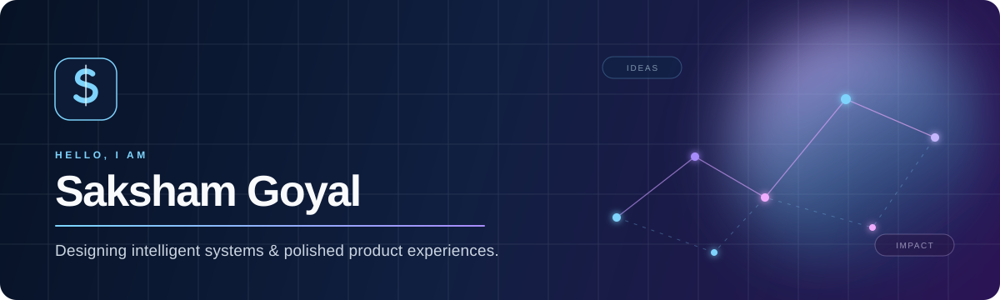

<p align="center">
  
</p>

<p align="center">
  <a href="https://github.com/Sakshamm-Goyal?tab=repositories">Explore the code</a>
  &nbsp;·&nbsp;
  <a href="https://github.com/Sakshamm-Goyal?tab=projects">See what I am building</a>
  &nbsp;·&nbsp;
  <a href="https://github.com/Sakshamm-Goyal">Start a conversation</a>
</p>

<br />

## Building at the intersection of AI, systems, and product craft

I am **Saksham Goyal** — a developer who turns ambitious ideas into thoughtful, usable software. My work moves between intelligent workflows, data-rich interfaces, and secure cross-platform systems.

I care about the full arc: a clear problem, an elegant interface, reliable engineering, and the small details that make a product feel inevitable.

<p align="center">
  <code>AI applications</code>
  <code>full-stack systems</code>
  <code>real-time experiences</code>
  <code>developer-first UX</code>
</p>

## Selected work

<table>
  <tr>
    <td width="50%" valign="top">
      <h3>◈ SAP O2C Graph Explorer</h3>
      <p>Conversational exploration for complex order-to-cash data — natural-language queries, graph visualisation, streaming answers, and practical guardrails.</p>
      <p><code>Python</code> <code>FastAPI</code> <code>React</code> <code>NetworkX</code></p>
      <a href="https://dodge-ai-fde-8opd.onrender.com/">Live demo</a> · <a href="https://github.com/Sakshamm-Goyal/Dodge-AI-FDE">Source</a>
    </td>
    <td width="50%" valign="top">
      <h3>◌ LLM Workflow Builder</h3>
      <p>A visual canvas for composing AI workflows. Connect models, prompts, media processing, and background tasks into expressive, executable pipelines.</p>
      <p><code>TypeScript</code> <code>Next.js</code> <code>React Flow</code> <code>Prisma</code></p>
      <a href="https://llm-workflow-builder.onrender.com/">Live demo</a> · <a href="https://github.com/Sakshamm-Goyal/llm-workflow-builder">Source</a>
    </td>
  </tr>
  <tr>
    <td width="50%" valign="top">
      <h3>↔ Universal Clipboard</h3>
      <p>Privacy-first clipboard sync across Android and macOS, with end-to-end encryption, QR pairing, offline delivery, and a zero-knowledge relay.</p>
      <p><code>Go</code> <code>Kotlin</code> <code>Swift</code> <code>WebSockets</code></p>
      <a href="https://github.com/Sakshamm-Goyal/Clipshare">Explore the system</a>
    </td>
    <td width="50%" valign="top">
      <h3>✦ More experiments</h3>
      <p>From AI-powered dashboards and code analysis to finance, collaboration, and interface experiments — I use side projects to keep testing new ideas.</p>
      <p><code>JavaScript</code> <code>TypeScript</code> <code>Python</code></p>
      <a href="https://github.com/Sakshamm-Goyal/AI-Customizable-Dashboard">Dashboard</a> · <a href="https://github.com/Sakshamm-Goyal/AI-Code-Analyzer">Code Analyzer</a> · <a href="https://github.com/Sakshamm-Goyal?tab=repositories">All repositories</a>
    </td>
  </tr>
</table>

## How I like to build

```text
01  Start with the real user problem, not the feature list.
02  Make the complex interaction feel simple and fast.
03  Design the architecture for the happy path and the hard edges.
04  Ship, observe, refine — then raise the bar again.
```

## Toolbox, intentionally chosen

| Layer | Technologies I reach for |
| :-- | :-- |
| **Product UI** | TypeScript · React · Next.js · Tailwind CSS · React Flow |
| **Backend & data** | Python · FastAPI · Node.js · Go · PostgreSQL · Prisma |
| **AI & automation** | LLM integrations · streaming workflows · background jobs · evaluation-minded guardrails |
| **Platforms** | Kotlin · Swift · WebSockets · Docker · GitHub Actions |

<br />

<p align="center">
  <strong>Good software should feel calm on the surface and serious underneath.</strong>
  <br />
  <sub>Want to build something memorable? Browse the repositories and reach out through GitHub.</sub>
</p>

<p align="center">
  <a href="https://github.com/Sakshamm-Goyal">github.com/Sakshamm-Goyal</a>
</p>
